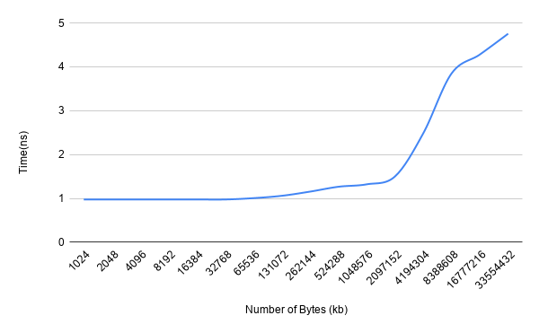

# Computer_Systems_HW1

**Part 1**

To read from the buffer, I have created a vector of ints that is the size of the amount of bytes being read divided by the size of ints in C++ (4 bytes), made a variable entitled "x" of type int, and then iterated through the buffer, copying one value to 'x' each time. In order to trick the prefetcher, the strategy of which was helped by Eitan and a fellow student in lab, I made a second vector of indices that is the same size as the buffer. Then, for every read through the buffer, the indices vector was shuffled beforehand and the value buffer[indices[iterator]] was copied to 'x'. I used the "-o3" flag when compiling for the fastest code available. I also experimented with using the "-ofast" flag, yet that yielded similar results. I went with 100 tests in order to both ensure fast runs in the result, but not take forever with more tests.

**Part 2**

Here is the graph of the results of the program:

